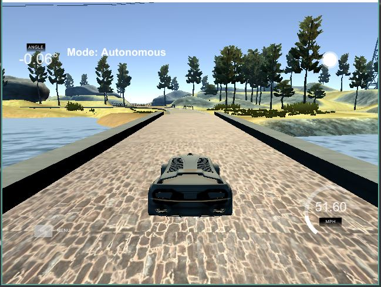
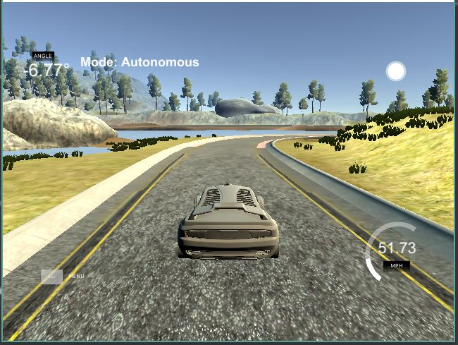
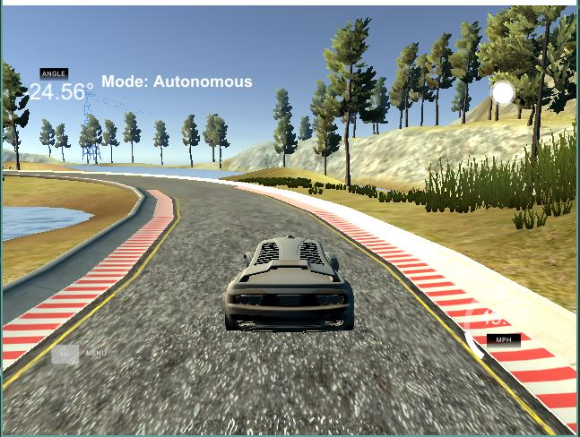
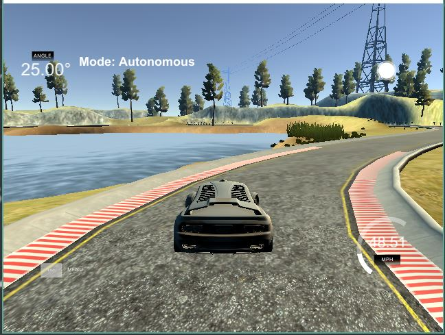
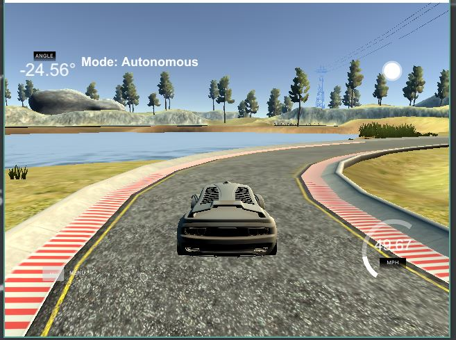

# CarND-Controls-PID
Self-Driving Car Engineer Nanodegree Program



---

## Dependencies

* cmake >= 3.5
 * All OSes: [click here for installation instructions](https://cmake.org/install/)
* make >= 4.1(mac, linux), 3.81(Windows)
  * Linux: make is installed by default on most Linux distros
  * Mac: [install Xcode command line tools to get make](https://developer.apple.com/xcode/features/)
  * Windows: [Click here for installation instructions](http://gnuwin32.sourceforge.net/packages/make.htm)
* gcc/g++ >= 5.4
  * Linux: gcc / g++ is installed by default on most Linux distros
  * Mac: same deal as make - [install Xcode command line tools]((https://developer.apple.com/xcode/features/)
  * Windows: recommend using [MinGW](http://www.mingw.org/)
* [uWebSockets](https://github.com/uWebSockets/uWebSockets)
  * Run either `./install-mac.sh` or `./install-ubuntu.sh`.
  * If you install from source, checkout to commit `e94b6e1`, i.e.
    ```
    git clone https://github.com/uWebSockets/uWebSockets 
    cd uWebSockets
    git checkout e94b6e1
    ```
    Some function signatures have changed in v0.14.x. See [this PR](https://github.com/udacity/CarND-MPC-Project/pull/3) for more details.
* Simulator. You can download these from the [project intro page](https://github.com/udacity/self-driving-car-sim/releases) in the classroom.

There's an experimental patch for windows in this [PR](https://github.com/udacity/CarND-PID-Control-Project/pull/3)

## Basic Build Instructions

1. Clone this repo.
2. Make a build directory: `mkdir build && cd build`
3. Compile: `cmake .. && make`
4. Run it: `./pid`. 

Tips for setting up your environment can be found [here](https://classroom.udacity.com/nanodegrees/nd013/parts/40f38239-66b6-46ec-ae68-03afd8a601c8/modules/0949fca6-b379-42af-a919-ee50aa304e6a/lessons/f758c44c-5e40-4e01-93b5-1a82aa4e044f/concepts/23d376c7-0195-4276-bdf0-e02f1f3c665d)

## Reflection

I decided to use PID control for both throttle and steering. PID 
stands for Proportional, Integral and Derivative. 

The Proportional component provides a consistent proportional 
correction against the direction of the error.  

The Integral component provides correction against the magnitude
of the accumulated error over time. It aims at settling the process
toward the goal value, and avoids settling on an offset-value.

The Derivative component helps for swifter correction and improves
settling time. It is effective at preventing overshoot.  It does not
consider the magnitude of the error, but rather the rate of change
of the error.  It aims at flattening the error trajectory.

In regard to the simulator used in this project, the proportional and 
integral steering coeffients were best set as low values--around 0.2 
and 0.007 respectively.  The derivative component seemed to require 
increases along with increases in the target throttle.

I assumed a delta-time of 1 for the purposes of this project.

The PID coefficient values were roughly chosen through manual tuning
and then fine-tuned with twiddle optimization.

The screenshots below showcase some of the decisions made by the PID
controller in the simulation.  The steering PID controller is trying to
keep the car centered, while the throttle PID controller is given a
target throttle/speed of 0.5/50mph.

Below: Between turns, and attempting to control oscillations



Below: Hard left turn



Below: Hard right turn



Below: Straight road, well adjusted with minimal error.


Below: Hard, quick correction after an overshoot on a sharp turn. PID control, by itself, is ignorant of projected future states.


